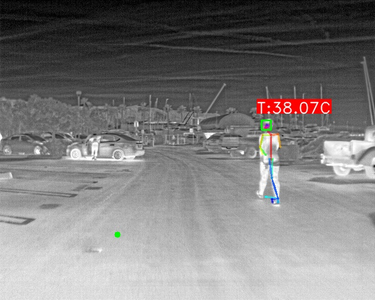
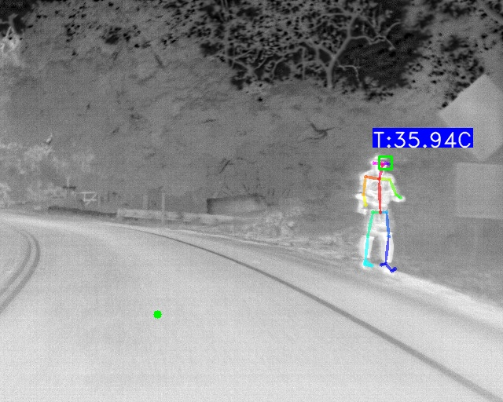

# :thermometer: AiThermometer :thermometer:
Code for automatically measuring the temperature of people using a thermal camera.
The software can be freely used for any non-commercial applications and it is useful
for the automatic early-screening of fever symptoms. The code is open and can be 
improved with your support, please contact us at aithermometer@iit.it if you want to help us.
<!-- github support emotiocons! https://gist.github.com/rxaviers/7360908-->




<!-- -->

## What's New
#### [April 7th, 2020]
+ New code for acquiring and processing data streams from FLIR<sup>&reg;</sup> cameras in the folder [FLIR_cameras](FLIR_cameras).


## Description
The software first detect people with an off-the-shelf body pose detector and then extract location of the face where the temperature is measured. The software requires a known reference temperature and the value and position are provided by the user (this information is shown as a single small green circle on the image). It is possible to have the absolute temperature but you need an image from a thermal camera with correct radiometric calibration and radiometric exif data loaded into image.

 
## Installation steps
Code is developed in Python3 and tested on Ubuntu 18.04 with NVidia driver, Cuda 10.0 and Cudnn 7.6.5. 

AiThermometer can be run in a Docker container, as described in [this section](#markdown-dockerfile).

* [x] **Install the requirements**  
To run this code without Docker support, you need to install:

    * **OpenPose**:    
    Please follow the instruction in the repository [gitHub](https://github.com/CMU-Perceptual-Computing-Lab/openpose) and install OpenPose in `ai_thermometer/openpose/` folder.   
    In case you prefer to use a different OpenPose installation folder, you can pass it using the `--openpose_folder` argument. 

    * **Flir Image Extractor**:  
        `pip3 install flirimageextractor`
     
    * **OpenCV**:    
        `apt-get install python3-opencv`  
        `pip3 install opencv-python`

* [x] **Install the Docker**  
You can install Docker following `docker_howto.txt` file instructions.  
After Docker installation, you can either build the available Dockerfile or download from `https://hub.docker.com/repository/docker/pmorerio/aithermometer` the already built image using:  
`docker pull pmorerio/aithermometer:release1`

## Usage
### With radiometric images
Usage Example in case the available images are radiometric:
```
./ai_thermometer.py --image_in ./samples/IR_2412.jpg --image_out ./results/IR_2412_out.jpg --radiometric True
```

### Without radiometric images 
The algorithm has been designed such that it can be used with uncalibrated thermal cameras: a reference pixel with known approximate temperature should be provided by the user.  
Usage Example:

```
./ai_thermometer.py --image_in ./samples/image1.jpeg --image_out ./results/image1_out.jpg --reference_px 200 --reference_py 400 --reference_temperature 31
```
#### Dockerfile 
Using the included Dockerfile you can automatically build an image with the required packages.

Build the images using
```
docker build -t ai_thermometer . 
```
 
Enter in the image bash using 
```
docker run -it --gpus all -v <local_folder>:/ai_thermometer/results ai_thermometer
```

Run the sample script using 
```
./test.sh
```

The resulting images will be stored in <local_folder>.

## Dataset
Below are some examples on the [FREE FLIR Thermal Dataset](https://www.flir.com/oem/adas/adas-dataset-form/).

<p float="left">


</p>

## Further development
* [ ] Increase the number of thermal cameras supported
* [ ] Increase people detection rate of openpose applied on thermal images
* [ ] Improve robustness of face measurement algorithm
* [ ] Automatic detection of masks, eyewear, scarf and other face occluding elements

## Disclaimer
The information and content provided by this application is for information purposes only. 
You hereby agree that you shall not make any health or medical related decision based in whole or in part on anything contained within the application without consulting your personal doctor.

The software is provided "as is", without warranty of any kind, express or implied, including but not limited to the warranties of merchantability, fitness for a particular purpose and noninfringement. In no event shall the authors, PAVIS or IIT be liable for any claim, damages or other liability, whether in an action of contract, tort or otherwise, arising from, out of or in connection with the software or the use or other dealings in the software.

## LICENSE
This project is licensed under the terms of the MIT license.

This project incorporates material from the projects listed below (collectively, "Third Party Code").  This Third Party Code is licensed to you under their original license terms.  We reserves all other rights not expressly granted, whether by implication, estoppel or otherwise.

1. [OpenPose](https://github.com/CMU-Perceptual-Computing-Lab/openpose) 
2. [OpenCV](https://opencv.org)
3. [flirimageextractor](https://pypi.org/project/flirimageextractor/)


